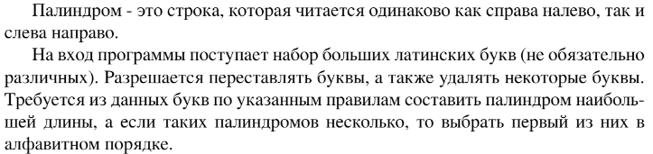

# Задание №10 по выбору: `Генерация палиндромов`
Выполнила студентка НИУ ИТМО, `Туманова Нелли Алексеевна` (ID: 467773)

## Вариант 21

## Задание 


## Input / Output 

| Input  | Output |
|--------|--------|
| AAB    | ABA    |
| QAZQAZ | AQZZQA |
| ABCDEF | A      |

## Ограничения по времени и памяти

- Ограничение по времени: `1 сек.`
- Ограничение по памяти: `64 мб.`


## Запуск проекта
1. Перейдите в папку задания:
```bash
cd Task10
```

2. Для запуска программы выполните:
```bash
python src/MakePalindrome.py
```

## Тестирование
Для запуска тестов выполните:
```bash
pytest tests/
```