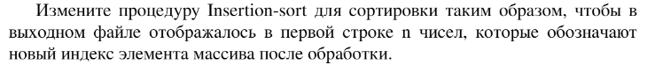

# Задание №2 по выбору: `Индексированная сортировка вставками`
Выполнила студентка НИУ ИТМО, `Туманова Нелли Алексеевна` (ID: 467773)

## Вариант 21

## Задание 


## Input / Output 

| Input               | Output                                       |
|---------------------|----------------------------------------------|
| 1 8 4 2 3 7 5 6 9 0 | 1 2 2 2 3 5 5 6 9 1 <br/>0 1 2 3 4 5 6 7 8 9 |
| 31 41 59 26 41 58   | 1 2 3 1 4 5 <br/>26 31 41 41 58 59           |
| -1 3 -5 33 2        | 1 2 1 4 3 <br/>-5 -1 2 3 33                  |

## Ограничения по времени и памяти

- Ограничение по времени: `2 сек.`
- Ограничение по памяти: `256 мб.`


## Запуск проекта
1. Перейдите в папку задания:
```bash
cd Task2
```

2. Для запуска программы выполните:
```bash
python src/InsertationSortIndexes.py
```

## Тестирование
Для запуска тестов выполните:
```bash
pytest tests/
```