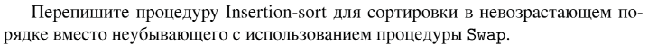

# Задание №3 по выбору: `Сортировка вставками по убыванию`
Выполнила студентка НИУ ИТМО, `Туманова Нелли Алексеевна` (ID: 467773)

## Вариант 21

## Задание 


## Input / Output 

| Input             | Output            |
|-------------------|-------------------|
| 6 5 4 3 2 1       | 6 5 4 3 2 1       |
| 31 41 59 26 41 58 | 59 58 41 41 31 26 |
| -1 3 -5 33 2      | 33 3 2 -1 -5      |

## Ограничения по времени и памяти

- Ограничение по времени: `2 сек.`
- Ограничение по памяти: `256 мб.`


## Запуск проекта
1. Перейдите в папку задания:
```bash
cd Task3
```

2. Для запуска программы выполните:
```bash
python src/InsertationSortReversed.py
```

## Тестирование
Для запуска тестов выполните:
```bash
pytest tests/
```