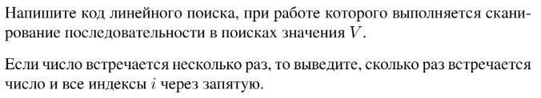

# Задание №4 по выбору: `Линейный поиск`
Выполнила студентка НИУ ИТМО, `Туманова Нелли Алексеевна` (ID: 467773)

## Вариант 21

## Задание 


## Input / Output 

| Input                    | Output     |
|--------------------------|------------|
| 6 5 4 3 2 1<br/>3        | 4          |
| 31 41 59 26 41 58<br/>41 | 2, 5       |
| 1 1 1 1<br/>1            | 1, 2, 3, 4 |

## Ограничения по времени и памяти

- Ограничение по времени: `2 сек.`
- Ограничение по памяти: `256 мб.`


## Запуск проекта
1. Перейдите в папку задания:
```bash
cd Task4
```

2. Для запуска программы выполните:
```bash
python src/Find.py
```

## Тестирование
Для запуска тестов выполните:
```bash
pytest tests/
```