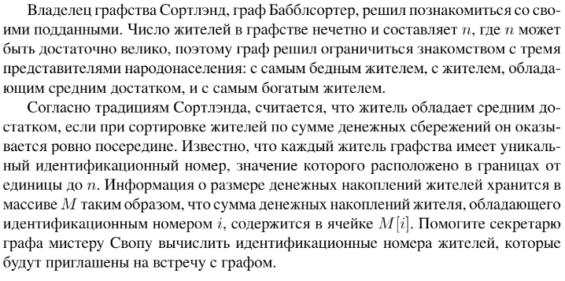

# Задание №7 по выбору: `Индексированная сортировка пузырьком`
Выполнила студентка НИУ ИТМО, `Туманова Нелли Алексеевна` (ID: 467773)

## Вариант 21

## Задание 


## Input / Output 

| Input                             | Output |
|-----------------------------------|--------|
| 10.00 8.70 0.01 5.00 3.00         | 3 4 1  |
| 31 41.3 59.00 26 41.1 58.056 0.03 | 7 5 3  |
| 1.5 3. 5 33 2                     | 1 2 4  |

## Ограничения по времени и памяти

- Ограничение по времени: `2 сек.`
- Ограничение по памяти: `256 мб.`


## Запуск проекта
1. Перейдите в папку задания:
```bash
cd Task7
```

2. Для запуска программы выполните:
```bash
python src/BubbleSortIndexes.py
```

## Тестирование
Для запуска тестов выполните:
```bash
pytest tests/
```