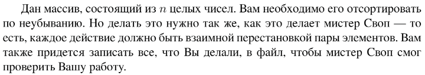
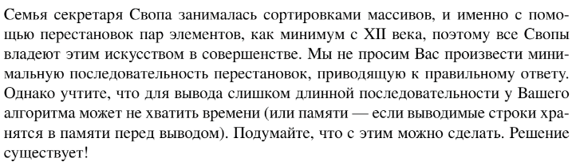

# Задание №8 по выбору: `Индексированная сортировка выбором`
Выполнила студентка НИУ ИТМО, `Туманова Нелли Алексеевна` (ID: 467773)

## Вариант 21

## Задание 



## Input / Output 

| Input                 | Output                                                                                                                                                                                                              |
|-----------------------|---------------------------------------------------------------------------------------------------------------------------------------------------------------------------------------------------------------------|
| 3 1 4 2 2             | Swap elements at indices 1 and 2.<br/>Swap elements at indices 2 and 4.<br/>Swap elements at indices 3 and 5.<br/>No more swaps needed.                                                                             |
| 31 41 59 26 41 58     | Swap elements at indices 1 and 4.<br/>Swap elements at indices 2 and 4.<br/>Swap elements at indices 3 and 4.<br/>Swap elements at indices 4 and 5.<br/>Swap elements at indices 5 and 6.<br/>No more swaps needed. |
| 1 2 3 4 5 6 6 6 7 8 9 | No more swaps needed.                                                                                                                                                                                               |

## Ограничения по времени и памяти

- Ограничение по времени: `1 сек.`
- Ограничение по памяти: `256 мб.`


## Запуск проекта
1. Перейдите в папку задания:
```bash
cd Task8
```

2. Для запуска программы выполните:
```bash
python src/SelectionSortIndexes.py
```

## Тестирование
Для запуска тестов выполните:
```bash
pytest tests/
```