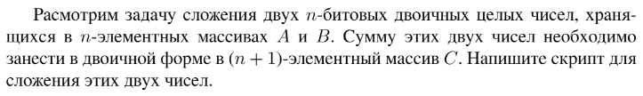

# Задание №9 по варианту : `Сложение бинарных чисел`
Выполнила студентка НИУ ИТМО, `Туманова Нелли Алексеевна` (ID: 467773)

## Вариант 21

## Задание 


## Input / Output 

| Input                         | Output            |
|-------------------------------|-------------------|
| 101001110111 1010101111100000 | 01011011001010111 |
| 0 0                           | 00                |
| 11111111 11111                | 100011110         |

## Ограничения по времени и памяти

- Ограничение по времени: `2 сек.`
- Ограничение по памяти: `256 мб.`


## Запуск проекта
1. Перейдите в папку задания:
```bash
cd Task9
```

2. Для запуска программы выполните:
```bash
python src/BinAdd.py
```

## Тестирование
Для запуска тестов выполните:
```bash
pytest tests/
```