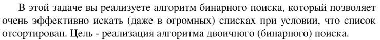

# Задание №4 по выбору: `Бинарный поиск`
Выполнила студентка НИУ ИТМО, `Туманова Нелли Алексеевна` (ID: 467773)

## Вариант 21

## Задание 


## Input / Output 

| Input                    | Output    |
|--------------------------|-----------|
| 6 5 4 3 2 1<br/>4        | 2         |
| 31 41 59 26 41 58<br/>41 | 1 (или 4) |
| -1 3 -5 33 2<br/>100     | -1        |

## Ограничения по времени и памяти

- Ограничение по времени: `2 сек.`
- Ограничение по памяти: `256 мб.`


## Запуск проекта
1. Перейдите в папку задания:
```bash
cd Task4
```

2. Для запуска программы выполните:
```bash
python src/BinPow.py
```

## Тестирование
Для запуска тестов выполните:
```bash
pytest tests/
```