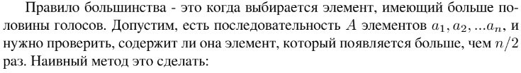
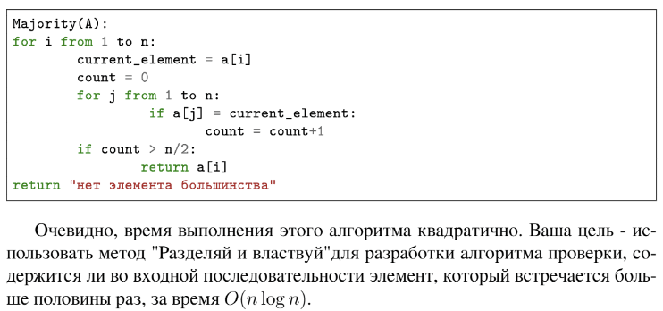

# Задание №5 по варианту : `Мажорирующий элемент`
Выполнила студентка НИУ ИТМО, `Туманова Нелли Алексеевна` (ID: 467773)

## Вариант 21

## Задание 



## Input / Output 

| Input       | Output |
|-------------|--------|
| 2 3 9 2 2   | 1      |
| 1 2 3 4     | 0      |
| 1 1 1 2 2 2 | 0      |

## Ограничения по времени и памяти

- Ограничение по времени: `2 сек.`
- Ограничение по памяти: `256 мб.`


## Запуск проекта
1. Перейдите в папку задания:
```bash
cd Task5
```

2. Для запуска программы выполните:
```bash
python src/MajorityElement.py
```

## Тестирование
Для запуска тестов выполните:
```bash
pytest tests/
```