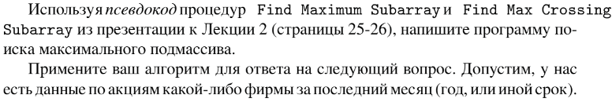
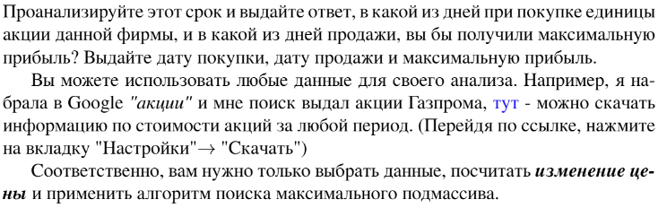

# Задание №7 по выбору: `Поиск максимального подмассива`
Выполнила студентка НИУ ИТМО, `Туманова Нелли Алексеевна` (ID: 467773)

## Вариант 21

## Задание 



## Input / Output 

| Input               | Output                          |
|---------------------|---------------------------------|
| 6 5 4 3 2 1         | start: 0<br/>end: 6<br/>sum: 21 |
| -2 4 -11 -1 23 0 -2 | start: 4<br/>end: 5<br/>sum: 23 |
| -1 3 -5 33 2        | start: 3<br/>end: 5<br/>sum: 35 |

## Ограничения по времени и памяти

- Ограничение по времени: `2 сек.`
- Ограничение по памяти: `256 мб.`


## Запуск проекта
1. Перейдите в папку задания:
```bash
cd Task7
```

2. Для запуска программы выполните:
```bash
python src/FindMaxSubarray.py
```

## Тестирование
Для запуска тестов выполните:
```bash
pytest tests/
```