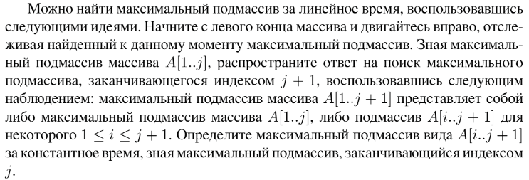

# Задание №8 по варианту : `Умножение полиномов`
Выполнила студентка НИУ ИТМО, `Туманова Нелли Алексеевна` (ID: 467773)

## Вариант 21

## Задание 


## Input / Output 

| Input                   | Output                       |
|-------------------------|------------------------------|
| 1 2 3<br/>1 2 3         | 1 4 10 12 9                  |
| 2<br/>2                 | 4                            |
| 3 2 1 0 1 2 3<br/>1 2 3 | 0 0 0 0 3 8 14 8 4 4 10 12 9 |

## Ограничения по времени и памяти

- Ограничение по времени: `2 сек.`
- Ограничение по памяти: `256 мб.`


## Запуск проекта
1. Перейдите в папку задания:
```bash
cd Task8
```

2. Для запуска программы выполните:
```bash
python src/MultPolynomials.py
```

## Тестирование
Для запуска тестов выполните:
```bash
pytest tests/
```