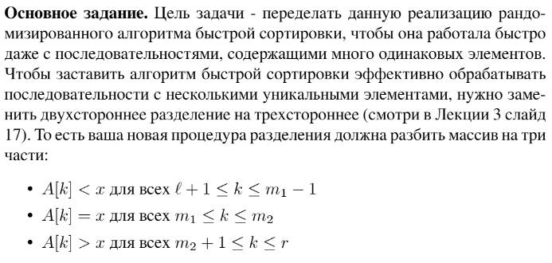

# Задание №1 по варианту: `Быстрая сортировка`
Выполнила студентка НИУ ИТМО, `Туманова Нелли Алексеевна` (ID: 467773)

## Вариант 21

## Задание 


## Input / Output 

| Input             | Output            |
|-------------------|-------------------|
| 6 5 4 3 2 1       | 1 2 3 4 5 6       |
| 31 41 59 26 41 58 | 26 31 41 41 58 59 |
| -1 3 -5 33 2      | -5 -1 2 3 33      |

## Ограничения по времени и памяти

- Ограничение по времени: `2 сек.`
- Ограничение по памяти: `256 мб.`


## Запуск проекта
1. Перейдите в папку задания:
```bash
cd Task1
```

2. Для запуска программы выполните:
```bash
python src/QuickSort.py
```

## Тестирование
Для запуска тестов выполните:
```bash
pytest tests/
```