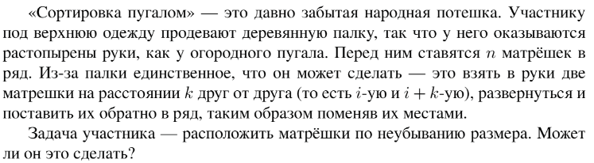

# Задание №1 по варианту: `Сортировка пугалом`
Выполнила студентка НИУ ИТМО, `Туманова Нелли Алексеевна` (ID: 467773)

## Вариант 21

## Задание 


## Input / Output 

| Input           | Output |
|-----------------|--------|
| 2<br/>2 1 3     | YES    |
| 3<br/>1 5 3 4 1 | NO     |
| 100<br/>1 2 3 4 | YES    |

## Ограничения по времени и памяти

- Ограничение по времени: `2 сек.`
- Ограничение по памяти: `256 мб.`


## Запуск проекта
1. Перейдите в папку задания:
```bash
cd Task3
```

2. Для запуска программы выполните:
```bash
python src/ScarecrowSort.py
```

## Тестирование
Для запуска тестов выполните:
```bash
pytest tests/
```