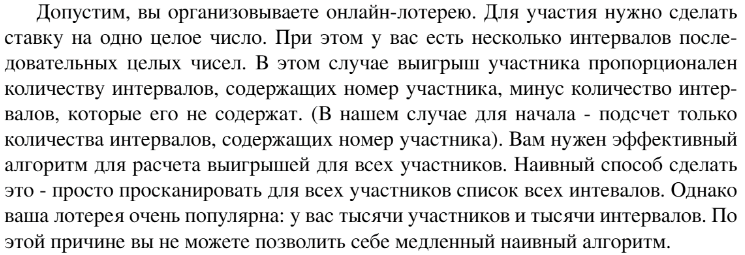
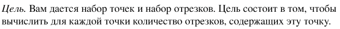

# Задание №4 по варианту: `Отрезки и точки`
Выполнила студентка НИУ ИТМО, `Туманова Нелли Алексеевна` (ID: 467773)

## Вариант 21

## Задание 



## Input / Output 

| Input                             | Output    |
|-----------------------------------|-----------|
| 0 5<br/>-3 2<br/>7 10<br/>1 3 6   | 2 1 0     |
| 1 2<br/>2 3<br/>3 4<br/>0 1 2 3 4 | 0 1 2 2 1 |
| 0 5<br/>7 10<br/>1 6 11           | 1 0 0     |

## Ограничения по времени и памяти

- Ограничение по времени: `2 сек.`
- Ограничение по памяти: `256 мб.`


## Запуск проекта
1. Перейдите в папку задания:
```bash
cd Task4
```

2. Для запуска программы выполните:
```bash
python src/SectionsAndPoints.py
```

## Тестирование
Для запуска тестов выполните:
```bash
pytest tests/
```
