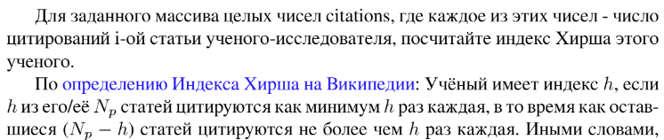
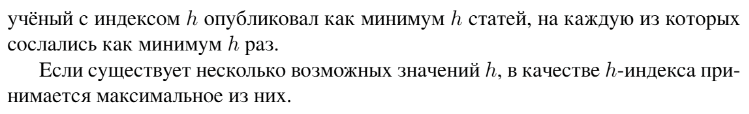

# Задание №5 по выбору: `Индекс Хирша`
Выполнила студентка НИУ ИТМО, `Туманова Нелли Алексеевна` (ID: 467773)

## Вариант 21

## Задание 



## Input / Output 

| Input        | Output       |
|--------------|--------------|
| 3 0 6 1 5    | 3            |
| 1 3 1        | 1            |

## Ограничения по времени и памяти

- Ограничение по времени: `2 сек.`
- Ограничение по памяти: `256 мб.`


## Запуск проекта
1. Перейдите в папку задания:
```bash
cd Task5
```

2. Для запуска программы выполните:
```bash
python src/Hirsch.py
```

## Тестирование
Для запуска тестов выполните:
```bash
pytest tests/
```