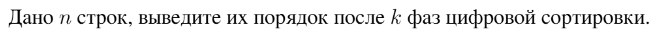

# Задание №7 по выбору: `Поразрядная сортировка`
Выполнила студентка НИУ ИТМО, `Туманова Нелли Алексеевна` (ID: 467773)

## Вариант 21

## Задание 


## Input / Output 

| Input                       | Output |
|-----------------------------|--------|
| 3 1<br/>bab<br/>bba<br/>baa | 2 3 1  |
| 3 2<br/>bab<br/>bba<br/>baa | 3 1 2  |
| 3 3<br/>bab<br/>bba<br/>baa | 3 1 2  |

## Ограничения по времени и памяти

- Ограничение по времени: `3 сек.`
- Ограничение по памяти: `256 мб.`


## Запуск проекта
1. Перейдите в папку задания:
```bash
cd Task7
```

2. Для запуска программы выполните:
```bash
python src/RadixSort.py
```

## Тестирование
Для запуска тестов выполните:
```bash
pytest tests/
```