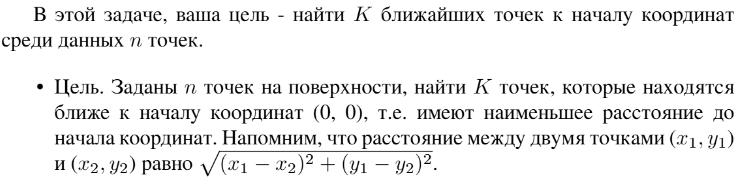

# Задание №8 по выбору: `Поиск ближайших точек к началу координат`
Выполнила студентка НИУ ИТМО, `Туманова Нелли Алексеевна` (ID: 467773)

## Вариант 21

## Задание 


## Input / Output 

| Input                       | Output                |
|-----------------------------|-----------------------|
| 1<br/>1 3<br/>-2 2          | \[-2, 2]              |
| 2<br/>3 3<br/>5 -1<br/>-2 4 | \[3, 3] \[-2, 4]      |
| 1<br/>1 3<br/>-1 -3         | \[1, 3] или \[-1, -3] |

## Ограничения по времени и памяти

- Ограничение по времени: `3 сек.`
- Ограничение по памяти: `256 мб.`


## Запуск проекта
1. Перейдите в папку задания:
```bash
cd Task8
```

2. Для запуска программы выполните:
```bash
python src/NearestPoints.py
```

## Тестирование
Для запуска тестов выполните:
```bash
pytest tests/
```