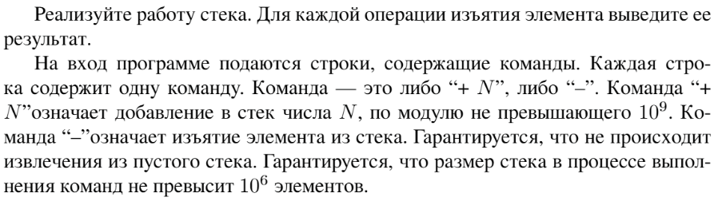

# Задание №1 по варианту: `Стек`
Выполнила студентка НИУ ИТМО, `Туманова Нелли Алексеевна` (ID: 467773)

## Вариант 21

## Задание 


## Input / Output 

| Input                                                             | Output                    |
|-------------------------------------------------------------------|---------------------------|
| + 1<br/>+ 2<br/>+ 3<br/>-<br/>-<br/>+ 5<br/>+ 4<br/>-<br/>-<br/>- | 3<br/>2<br/>4<br/>5<br/>1 |
| + 1<br/>+ 10<br/>-<br/>+ 2<br/>+ 1234<br/>-                       | 10<br/>1234               |

## Ограничения по времени и памяти

- Ограничение по времени: `2 сек.`
- Ограничение по памяти: `256 мб.`


## Запуск проекта
1. Перейдите в папку задания:
```bash
cd Task1
```

2. Для запуска программы выполните:
```bash
python src/Stack.py
```

## Тестирование
Программа реализована на стеке из [задания 13](../Task13/README.md) тесты можно выполнить в соответствующей папке.
Чтобы проверить время и память выполните:
```bash
python tests/StackFile_test.py
```