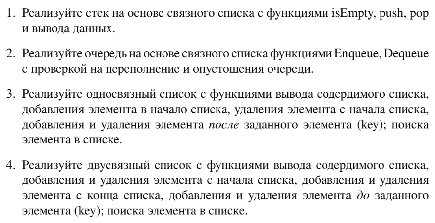

# Задание №13 по выбору: `Односвязный и двусвязный списки, стек и очередь на их основе`
Выполнила студентка НИУ ИТМО, `Туманова Нелли Алексеевна` (ID: 467773)

## Вариант 21

## Задание 


## Input / Output 
Требуется только реализация соответствующий классов и их тестирование

## Ограничения по времени и памяти

- Ограничение по времени для отдельного задания: `2 сек.`
- Ограничение по памяти для отдельного задания: `256 мб.`

## Запуск проекта
Перейдите в папку задания:
```bash
cd Task13
```

## Тестирование
1. Для запуска всех тестов выполните:
```bash
pytest tests/
```

2. Для запуска тестов для односвязного списка выполните:
```bash
pytest tests/SingleLinkedList_test.py
```

3. Для запуска тестов для двусвязного списка выполните:
```bash
pytest tests/List_test.py
```

4. Для запуска тестов для стека на основе односвязного списка выполните:
```bash
pytest tests/Stack_test.py
```

5. Для запуска тестов для очереди на основе двусвязного списка выполните:
```bash
pytest tests/Queue_test.py
```

