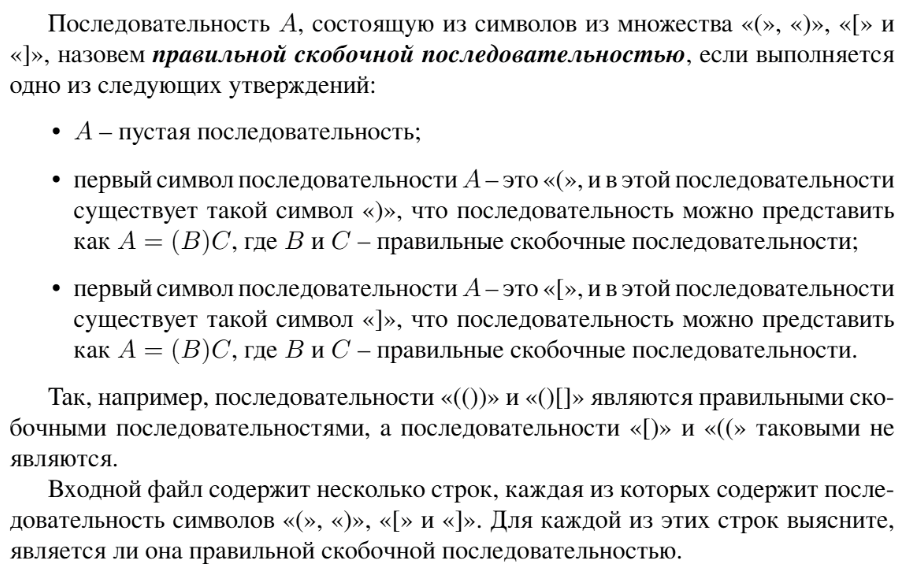

# Задание №3 по варианту: `Скобочные последовательности`
Выполнила студентка НИУ ИТМО, `Туманова Нелли Алексеевна` (ID: 467773)

## Вариант 21

## Задание 


## Input / Output 

| Input                                   | Output                           |
|-----------------------------------------|----------------------------------|
| ()()<br/>([])<br/>(\[)]<br/>((]]<br/>)( | YES<br/>YES<br/>NO<br/>NO<br/>NO |
| ([])<br/>()()()<br/>(\[\[]()])(         | YES<br/>YES<br/>NO               |

## Ограничения по времени и памяти

- Ограничение по времени: `2 сек.`
- Ограничение по памяти: `256 мб.`


## Запуск проекта
1. Перейдите в папку задания:
```bash
cd Task3
```

2. Для запуска программы выполните:
```bash
python src/Brackets.py
```

## Тестирование
Для запуска тестов выполните:
```bash
pytest tests/
```