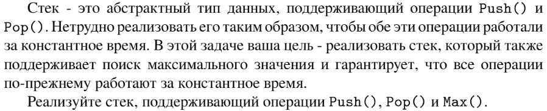

# Задание №5 по варианту: `Стек с быстрым поиском максимума`
Выполнила студентка НИУ ИТМО, `Туманова Нелли Алексеевна` (ID: 467773)

## Вариант 21

## Задание 


## Input / Output 

| Input                                     | Output  |
|-------------------------------------------|---------|
| push 2<br/>push 1<br/>max<br/>pop<br/>max | 2<br/>2 |
| push 1<br/>push 2<br/>max<br/>pop<br/>max | 2<br/>1 |
| push 1<br/>push 7<br/>pop                 |         |

## Ограничения по времени и памяти

- Ограничение по времени: `5 сек.`
- Ограничение по памяти: `512 мб.`


## Запуск проекта
1. Перейдите в папку задания:
```bash
cd Task5
```

2. Для запуска программы выполните:
```bash
python src/StackMax.py
```

## Тестирование
Для запуска тестов выполните:
```bash
pytest tests/
```