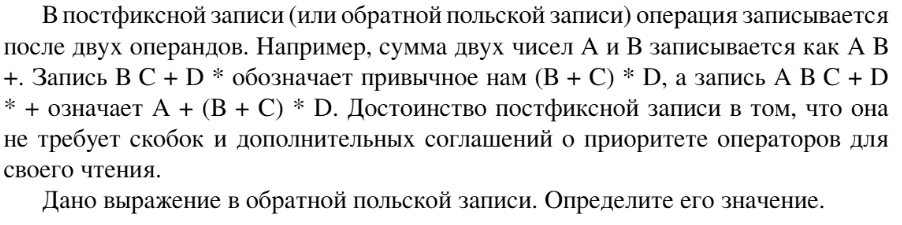

# Задание №8 по выбору: `Вычисление выражений в постфиксной записи`
Выполнила студентка НИУ ИТМО, `Туманова Нелли Алексеевна` (ID: 467773)

## Вариант 21

## Задание 


## Input / Output 

| Input                           | Output |
|---------------------------------|--------|
| 8 9 + 1 7 - *                   | -102   |
| 100 4 5 2 3 + 2 * * + 3 - 3 * - | -53    |
| 2 2 2 * +                       | 6      |

## Ограничения по времени и памяти

- Ограничение по времени: `2 сек.`
- Ограничение по памяти: `256 мб.`


## Запуск проекта
1. Перейдите в папку задания:
```bash
cd Task8
```

2. Для запуска программы выполните:
```bash
python src/Calculate.py
```

## Тестирование
Для запуска тестов выполните:
```bash
pytest tests/
```