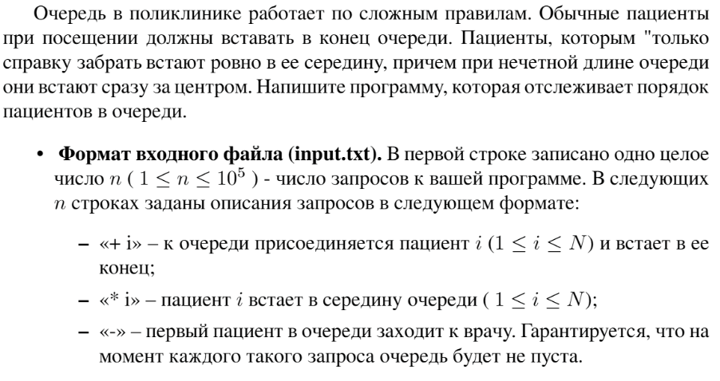

# Задание №9 по выбору: `Поликлиника: стек с возможностью добавления в середину`
Выполнила студентка НИУ ИТМО, `Туманова Нелли Алексеевна` (ID: 467773)

## Вариант 21

## Задание 


## Input / Output 

| Input                                                             | Output                    |
|-------------------------------------------------------------------|---------------------------|
| + 1<br/>+ 2<br/>* 3<br/>-<br/>+ 4<br/>* 5<br/>-<br/>-<br/>-<br/>- | 1<br/>3<br/>2<br/>5<br/>4 |
| + 1<br/>+ 2<br/>-<br/>+ 3<br/>+ 4<br/>-<br/>-                     | 1<br/>2<br/>3             |

## Ограничения по времени и памяти

- Ограничение по времени: `2 сек.`
- Ограничение по памяти: `256 мб.`


## Запуск проекта
1. Перейдите в папку задания:
```bash
cd Task9
```

2. Для запуска программы выполните:
```bash
python src/Polyclinic.py
```

## Тестирование
Для запуска тестов выполните:
```bash
pytest tests/
```