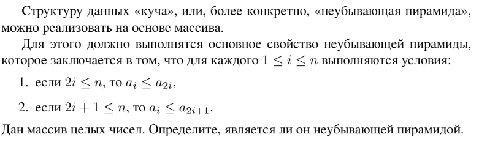

# Задание №1 по выбору: `Куча ли?`
Выполнила студентка НИУ ИТМО, `Туманова Нелли Алексеевна` (ID: 467773)

## Вариант 21

## Задание 


## Input / Output 

| Input     | Output |
|-----------|--------|
| 1 0 1 2 0 | NO     |
| 1 3 2 5 4 | YES    |

## Ограничения по времени и памяти

- Ограничение по времени: `2 сек.`
- Ограничение по памяти: `256 мб.`


## Запуск проекта
1. Перейдите в папку задания:
```bash
cd Task1
```

2. Для запуска программы выполните:
```bash
python src/CheckHeap.py
```

## Тестирование
Для запуска тестов выполните:
```bash
pytest tests/
```