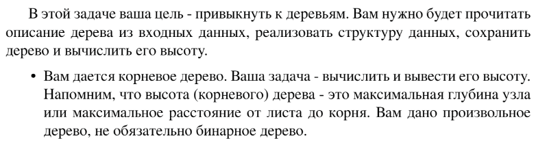

# Задание №2 по выбору: `Высота дерева`
Выполнила студентка НИУ ИТМО, `Туманова Нелли Алексеевна` (ID: 467773)

## Вариант 21

## Задание 


## Input / Output 

| Input      | Output |
|------------|--------|
| 4 -1 4 1 1 | 3      |
| -1 0 4 0 3 | 4      |

## Ограничения по времени и памяти

- Ограничение по времени: `3 сек.`
- Ограничение по памяти: `512 мб.`


## Запуск проекта
1. Перейдите в папку задания:
```bash
cd Task2
```

2. Для запуска программы выполните:
```bash
python src/TreeHeight.py
```

## Тестирование
Для запуска тестов выполните:
```bash
pytest tests/
```