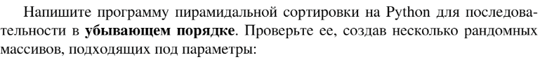

# Задание №7 по варианту: `Пирамидальная сортировка (кучей)`
Выполнила студентка НИУ ИТМО, `Туманова Нелли Алексеевна` (ID: 467773)

## Вариант 21

## Задание 


## Input / Output 

| Input     | Output    |
|-----------|-----------|
| 5 4 3 2 1 | 1 2 3 4 5 |
| 1 2 3 4 5 | 1 2 3 4 5 |
| 5 1 3 4 2 | 1 2 3 4 5 |

## Ограничения по времени и памяти

- Ограничение по времени: `3 сек.`
- Ограничение по памяти: `512 мб.`


## Запуск проекта
1. Перейдите в папку задания:
```bash
cd Task7
```

2. Для запуска программы выполните:
```bash
python src/Heap.py
```

## Тестирование
Для запуска тестов выполните:
```bash
pytest tests/
```