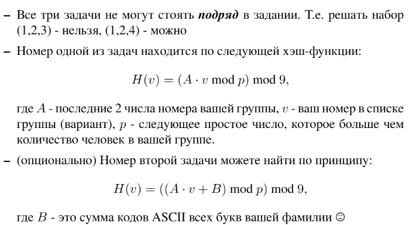

# Лабораторная работа №6: `Хеширование. Хеш-таблицы`
Выполнила студентка НИУ ИТМО, `Туманова Нелли Алексеевна` (ID: 467773)

## Вариант 21
### Условия 

Номер одной из задач должен быть равен $(41 \cdot 21 \bmod 29) \bmod 9 = 20 \bmod 9 =$ **2**

Номер другой задачи — $((41 \cdot 21 + 843) \bmod 29) \bmod 9 = 22 \bmod 9 =$ **4**
### Навигация

- [ ] [Задача 1 - Множество](Task1/README.md)
- [ ] [Задача 2 - Телефонная книга](Task2/README.md)
- [ ] [Задача 4 - Прошитый ассоциативный массив](Task4/README.md)
- [ ] [Задача 7 - Драгоценные камни](Task7/README.md)
- [ ] [Задача 9 - Убийца хешей](Task9/README.md)

## Описание
В этой лабораторной работе студенты узнают, что такое хеш-функции, научатся реализовывать 
структуры данных, основанных на хешировании (множество, словарь, прошитый ассоциативный массив) 
и правильно использовать их.

Основные задачи включают в себя реализацию соответствующих классов и функций на их основе, 
тестирование работы структуры и алгоритмов, их анализ.

## Запуск проекта
1. Перейдите в папку с лабораторной:
```bash
cd Lab6
```

2. Для запуска всех задач выполните:
```bash
python RunLabSources.py
```


## Тестирование
Для запуска всех тестов для лабораторной выполните в папке Lab2:
```bash
python RunLabTests.py
```
