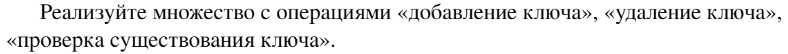
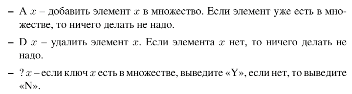

# Задание №1 по варианту: `Множество`
Выполнила студентка НИУ ИТМО, `Туманова Нелли Алексеевна` (ID: 467773)

## Вариант 21

## Задание 
 


## Input / Output 

| Input                                                       | Output            |
|-------------------------------------------------------------|-------------------|
| A 2<br/>A 5<br/>A 3<br/>? 2<br/>? 4<br/>A 2<br/>D 2<br/>? 2 | YES<br/>NO<br/>NO |

## Ограничения по времени и памяти

- Ограничение по времени: `2 сек.`
- Ограничение по памяти: `256 мб.`


## Запуск проекта
1. Перейдите в папку задания:
```bash
cd Task1
```

2. Для запуска программы выполните:
```bash
python src/CustomSet.py
```

## Тестирование
Для запуска тестов выполните:
```bash
pytest tests/
```