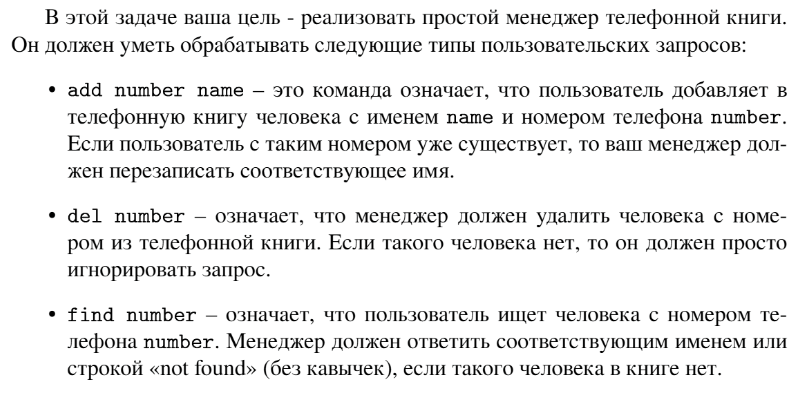

# Задание №2 по варианту: `Телефонная книга`
Выполнила студентка НИУ ИТМО, `Туманова Нелли Алексеевна` (ID: 467773)

## Вариант 21

## Задание 


## Input / Output 

| Input                                                                                                                                                                              | Output                                                       |
|------------------------------------------------------------------------------------------------------------------------------------------------------------------------------------|--------------------------------------------------------------|
| add 911 police<br/>add 76213 Mom<br/>add 17239 Bob<br/>find 76213<br/>find 910<br/>find 911<br/>del 910<br/>del 911<br/>find 911<br/>find 76213<br/>add 76213 daddy<br/>find 76213 | Mom<br/>not found<br/>police<br/>not found<br/>Mom<br/>daddy |

## Ограничения по времени и памяти

- Ограничение по времени: `6 сек.`
- Ограничение по памяти: `512 мб.`


## Запуск проекта
1. Перейдите в папку задания:
```bash
cd Task2
```

2. Для запуска программы выполните:
```bash
python src/PhoneBook.py
```

## Тестирование
Для запуска тестов выполните:
```bash
pytest tests/
```