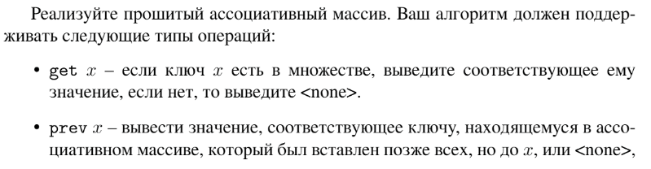
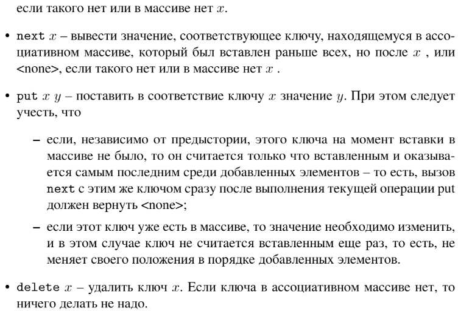

# Задание №4 по варианту: `Прошитый ассоциативный массив`
Выполнила студентка НИУ ИТМО, `Туманова Нелли Алексеевна` (ID: 467773)

## Вариант 21

## Задание 



## Input / Output 

| Input                                                                                                                                                                                           | Output                                      |
|-------------------------------------------------------------------------------------------------------------------------------------------------------------------------------------------------|---------------------------------------------|
| put zero a<br/>put one b<br/>put two c<br/>put three d<br/>put four e<br/>get two<br/>prev two<br/>next two<br/>delete one<br/>delete three<br/>get two<br/>prev two<br/>next two<br/>next four | c<br/>b<br/>d<br/>c<br/>a<br/>e<br/>\<none> |

## Ограничения по времени и памяти

- Ограничение по времени: `4 сек.`
- Ограничение по памяти: `256 мб.`


## Запуск проекта
1. Перейдите в папку задания:
```bash
cd Task4
```

2. Для запуска программы выполните:
```bash
python src/AssociativeArray.py
```

## Тестирование
Для запуска тестов выполните:
```bash
pytest tests/
```