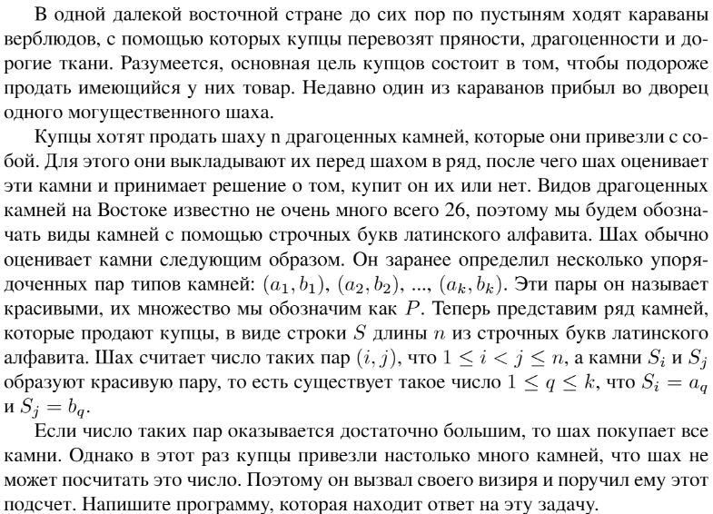

# Задание №7 по выбору: `Драгоценные камни`
Выполнила студентка НИУ ИТМО, `Туманова Нелли Алексеевна` (ID: 467773)

## Вариант 21

## Задание 


## Input / Output 

| Input                        | Output |
|------------------------------|--------|
| abacaba<br/>aa               | 6      |
| abacaba<br/>ab<br/>ac<br/>bb | 7      |

## Ограничения по времени и памяти

- Ограничение по времени: `1 сек.`
- Ограничение по памяти: `64 мб.`


## Запуск проекта
1. Перейдите в папку задания:
```bash
cd Task7
```

2. Для запуска программы выполните:
```bash
python src/Stones.py
```

## Тестирование
Для запуска тестов выполните:
```bash
pytest tests/
```