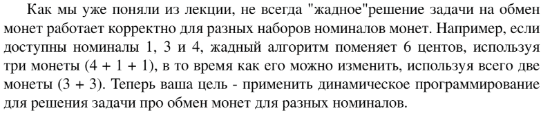
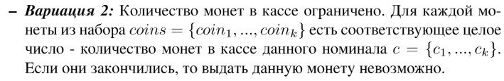

# Задание №1 по варианту: `Монеты`
Выполнила студентка НИУ ИТМО, `Туманова Нелли Алексеевна` (ID: 467773)

## Вариант 21

## Задание 

Усложнение:


## Input / Output 

| Input        | Output |
|--------------|--------|
| 2<br/>1 3 4  | 2      |
| 34<br/>1 3 4 | 9      |
| 5<br/>3 6    | None   |

## Ограничения по времени и памяти

- Ограничение по времени: `1 сек.`
- Ограничение по памяти: `128 мб.`


## Запуск проекта
1. Перейдите в папку задания:
```bash
cd Task1
```

2. Для запуска программы выполните:
```bash
python src/Coins.py
```

## Тестирование
Для запуска тестов выполните:
```bash
pytest tests/
```