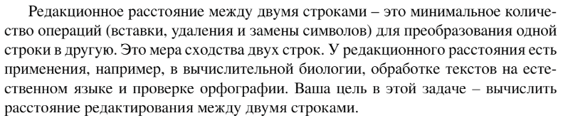

# Задание №3 по выбору: `Редакционное расстояние`
Выполнила студентка НИУ ИТМО, `Туманова Нелли Алексеевна` (ID: 467773)

## Вариант 21

## Задание 


## Input / Output 

| Input                | Output |
|----------------------|--------|
| kitten<br/>kitten    | 0      |
| short<br/>ports      | 3      |
| editing<br/>distance | 5      |

## Ограничения по времени и памяти

- Ограничение по времени: `2 сек.`
- Ограничение по памяти: `256 мб.`


## Запуск проекта
1. Перейдите в папку задания:
```bash
cd Task3
```

2. Для запуска программы выполните:
```bash
python src/EditingDistance.py
```

## Тестирование
Для запуска тестов выполните:
```bash
pytest tests/
```