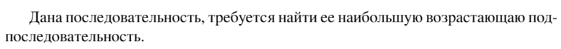

# Задание №6 по выбору: `Наибольшая возрастающая подпоследовательность`
Выполнила студентка НИУ ИТМО, `Туманова Нелли Алексеевна` (ID: 467773)

## Вариант 21

## Задание 


## Input / Output 

| Input         | Output    |
|---------------|-----------|
| 1 2 3 4 5     | 1 2 3 4 5 |
| 5 4 3 2 1     | 1         |
| 3 29 5 5 28 6 | 3 4 6     |

## Ограничения по времени и памяти

- Ограничение по времени: `2 сек.`
- Ограничение по памяти: `256 мб.`


## Запуск проекта
1. Перейдите в папку задания:
```bash
cd Task6
```

2. Для запуска программы выполните:
```bash
python src/IncreasingSubarray.py
```

## Тестирование
Для запуска тестов выполните:
```bash
pytest tests/
```