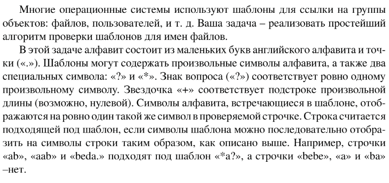

# Задание №1 по варианту: `Шаблоны`
Выполнила студентка НИУ ИТМО, `Туманова Нелли Алексеевна` (ID: 467773)

## Вариант 21

## Задание 


## Input / Output 

| Input            | Output |
|------------------|--------|
| k?t*n<br/>kitten | YES    |
| k?t?n<br/>kitten | NO     |
| *en<br/>kitten   | YES    |

## Ограничения по времени и памяти

- Ограничение по времени: `2 сек.`
- Ограничение по памяти: `256 мб.`


## Запуск проекта
1. Перейдите в папку задания:
```bash
cd Task7
```

2. Для запуска программы выполните:
```bash
python src/Pattern.py
```

## Тестирование
Для запуска тестов выполните:
```bash
pytest tests/
```